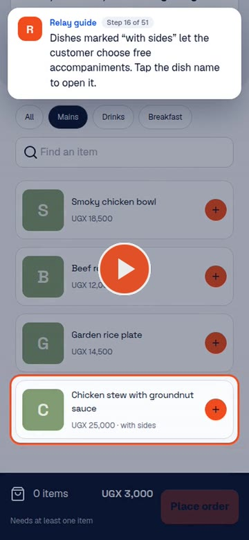
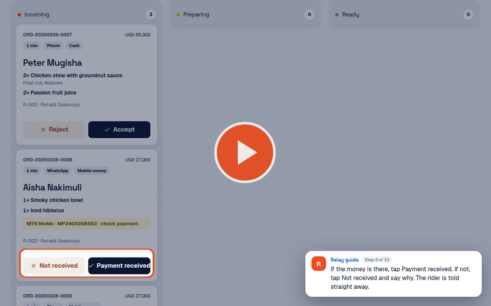
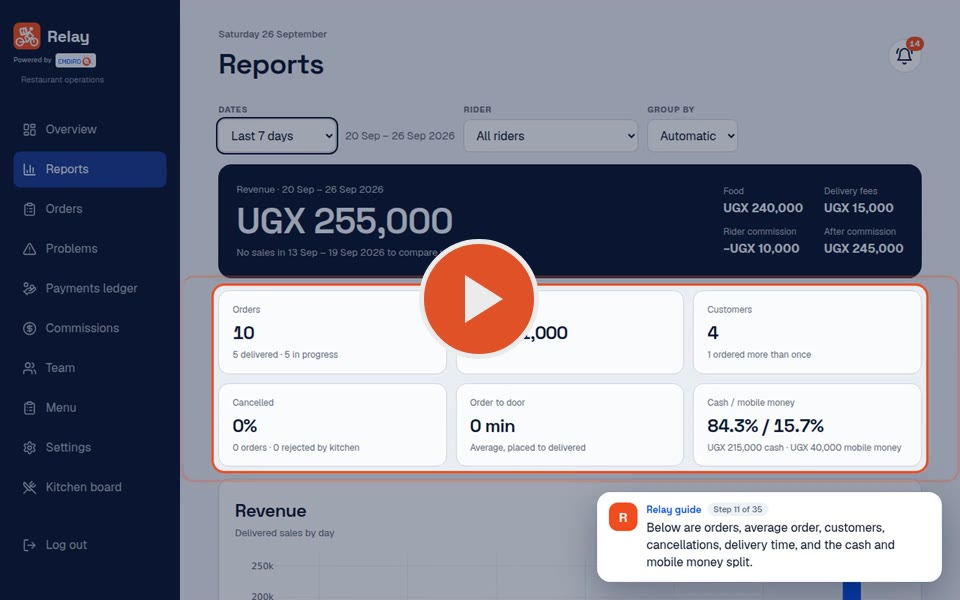

# Relay

Delivery operations for a single restaurant. Riders take orders for customers
and deliver them, cashiers run the kitchen board and count cash handovers, and
the owner sees every order, payment and shilling in one place.

Built with React + Vite (`src/`) and Parse Cloud Code (`cloud/`), deployed on
Back4App.

## Video guides

Short walkthroughs of everything each role can do. Each step shows an
on-screen guide explaining the feature and what to tap next. Click a picture
to watch.

<table>
  <tr>
    <th>Riders (phone) · 7 min</th>
    <th>Cashiers · 4½ min</th>
  </tr>
  <tr>
    <td align="center" valign="top">
      
    </td>
    <td align="center" valign="top">
      
    </td>
  </tr>
  <tr>
    <td valign="top">
      Sign in and start a shift · place an order (customer lookup, sides,
      notes, cash or mobile money) · follow it from accepted to delivered ·
      report a problem · hand over cash · earnings · why End shift is blocked
    </td>
    <td valign="top">
      Count the till to open a shift · check mobile money · accept, mark
      ready, hand to rider · count cash handovers · mark items sold out ·
      close the shift and explain any till difference
    </td>
  </tr>
  <tr>
    <th colspan="2">Owner / admin · 5½ min</th>
  </tr>
  <tr>
    <td colspan="2" align="center">
      
    </td>
  </tr>
  <tr>
    <td colspan="2">
      Overview · resolve rider problems · reports · orders search and export ·
      payments ledger and cashier shifts · commissions · add team members and
      set commission · add dishes · operating settings · kitchen board
    </td>
  </tr>
</table>

The videos are in [`docs/videos`](docs/videos). Download them to share with
staff on WhatsApp.

## Roles

| Role    | Signs in with       | Main screens                                                                                                   |
| ------- | ------------------- | -------------------------------------------------------------------------------------------------------------- |
| Rider   | Username + PIN      | Home, New order, Active orders, Cash, Earnings                                                                 |
| Cashier | Username + PIN      | Kitchen board, Cash handovers, Mobile money, Stock, Shift                                                      |
| Owner   | Username + password | Overview, Reports, Orders, Problems, Payments ledger, Commissions, Team, Menu, Settings, and the kitchen board |

## Development

You need Node 20.

    npm install
    npm run dev

- `npm run check` runs typecheck, lint, format, unit tests, the build and the
  Cloud Code bundle.
- After changing anything in `cloud/`, run `npm run build:cloud` and commit
  `back4app/cloud/main.js`. That single file is what gets uploaded to
  Back4App.
- `cd e2e && npm ci && PARSE_TEST_DATABASE_URI=... npm test` runs the Cloud
  Code end-to-end tests against a real Parse Server.

[`docs/ROADMAP.md`](docs/ROADMAP.md) has the product brief, conventions, the
Back4App release checklist, what is done and what is next.
[`README-EXPORT.md`](README-EXPORT.md) covers connecting a local copy to Parse.

Powered by Embiro — see [`NOTICE`](NOTICE).
