# RelayEats

**From kitchen to doorstep. Cash accounted.**

RelayEats runs a restaurant's deliveries, counter, kitchen and books on one live
system. Riders take orders at the customer's door on their phone. Cashiers run
the kitchen board, check payments and count the riders' cash. The owner sees
every order, payment and shilling across all branches, and the finance team
keeps the books.

RelayEats comes in two editions:

| Edition                | Branch   | What it is                                                                                                                               |
| ---------------------- | -------- | ---------------------------------------------------------------------------------------------------------------------------------------- |
| **Restaurant edition** | `main`   | One restaurant on its own Back4App app, with its own name, colours and payment accounts.                                                 |
| **RelayEats Hosted**   | `hosted` | Many restaurants on one platform. Owners sign up online with a free trial, choose a plan and pay a monthly subscription by mobile money. |

Built with React + Vite (`src/`) and Parse Cloud Code (`cloud/`), deployed on
Back4App. The screenshots below come from a demo restaurant, Mama Rose
Kitchen, with two branches (Kololo and Ntinda).

**Contents:**
[Riders](#riders) ·
[Kitchen and counter](#kitchen-and-counter) ·
[Owners](#owners) ·
[Finance](#finance) ·
[RelayEats Hosted](#relayeats-hosted) ·
[Who can do what](#who-can-do-what) ·
[Development](#development)

---

## Riders

Riders use RelayEats on their phone's browser. Nothing needs installing, but it can
be added to the home screen to open like an app.

<table>
  <tr>
    <td width="25%">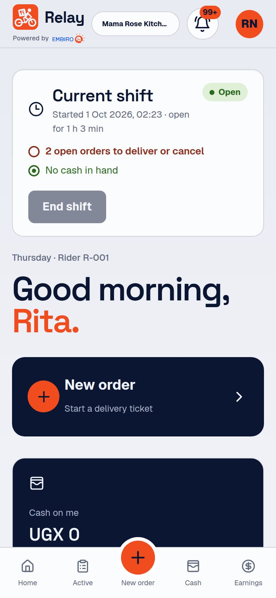</td>
    <td width="25%">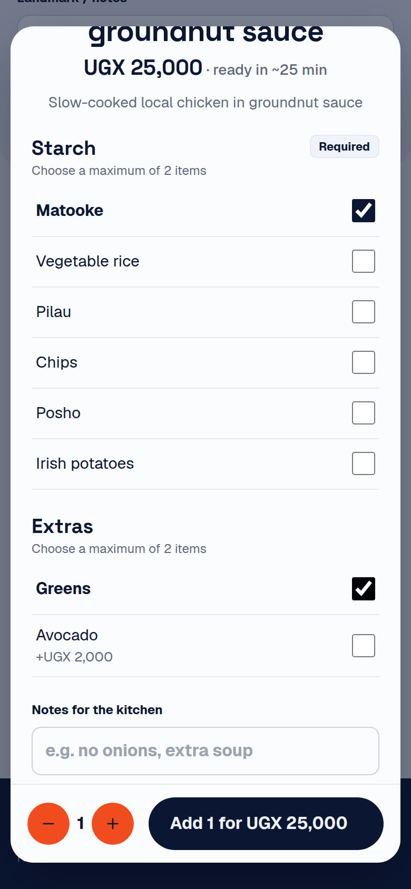</td>
    <td width="25%">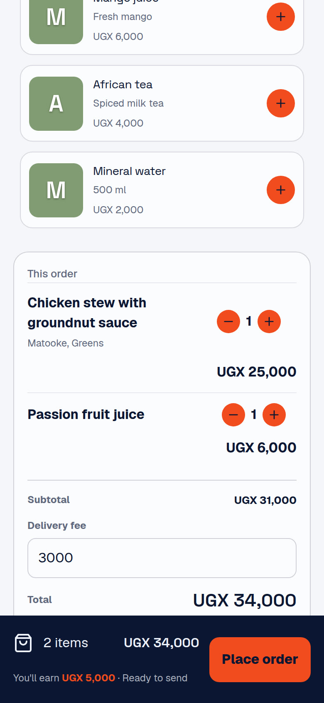</td>
    <td width="25%">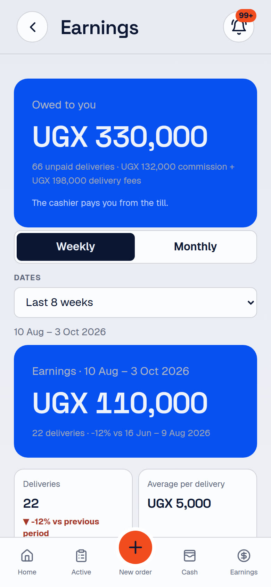</td>
  </tr>
  <tr>
    <td valign="top"><b>Home.</b> The open shift, what is left before it can end, cash on hand against the cash limit, and today's earnings.</td>
    <td valign="top"><b>A dish with sides.</b> The customer picks accompaniments. Each group says how many they can choose; extras show their price.</td>
    <td valign="top"><b>The order.</b> Lines, delivery fee and total, worked out by the server. Cash or mobile money.</td>
    <td valign="top"><b>Earnings.</b> Commission and delivery fees per order, by week or month, paid and still owed.</td>
  </tr>
</table>

**Taking an order**

1. Sign in with the username and PIN the owner gave you. Your shift starts.
2. Tap **New order**. Start typing the customer's name or phone. Returning
   customers pop up with their phone and address; **Repeat** copies their last
   order.
3. Choose the channel (walk-in, phone, WhatsApp). Pin the address on the map
   if it helps.
4. Pick dishes from the live menu. Only what the kitchen can make today, at
   your branch, is shown. Tap a dish to choose its sides and add a note for
   the kitchen; tap **+** to add a simple item.
5. **Split order** (optional): for a group, add the items for each person in
   their own split. The kitchen sees who gets what; the customer pays one bill.
6. Choose **Cash** or **Mobile money**. For mobile money, show the customer the
   merchant code and type the transaction ID from their SMS. The cashier
   checks it before the kitchen cooks.
7. Tap **Place order**.

**Delivering and handing over**

- Each step in the kitchen reaches you as a notification: accepted, ready.
  Tap **Confirm pickup** when you have the bag and **Confirm delivery** at the
  door. The customer pays the full total.
- 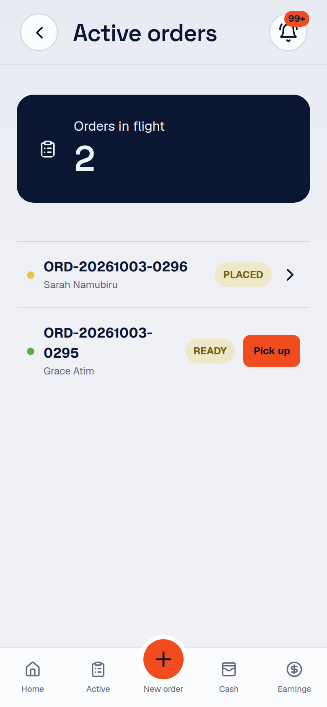
  **Active** lists every order still moving, and lets you pick up and deliver
  from the list.
- **Cash** lists the cash orders you have delivered but not handed over. Tick
  them, hand the cash to the cashier and confirm with your PIN. The cashier
  counts it and confirms.
- **Cash limit:** near the limit RelayEats warns you. At the limit you hand over
  before taking new orders.
- **Report a problem** on any order (a spilled bag, a missing item). The owner
  sees it at once.
- **End shift** only works once every order is finished and your cash has been
  handed over.

 

---

## Kitchen and counter

Cashiers work at one branch and see that branch's kitchen board, payments,
riders and cash.

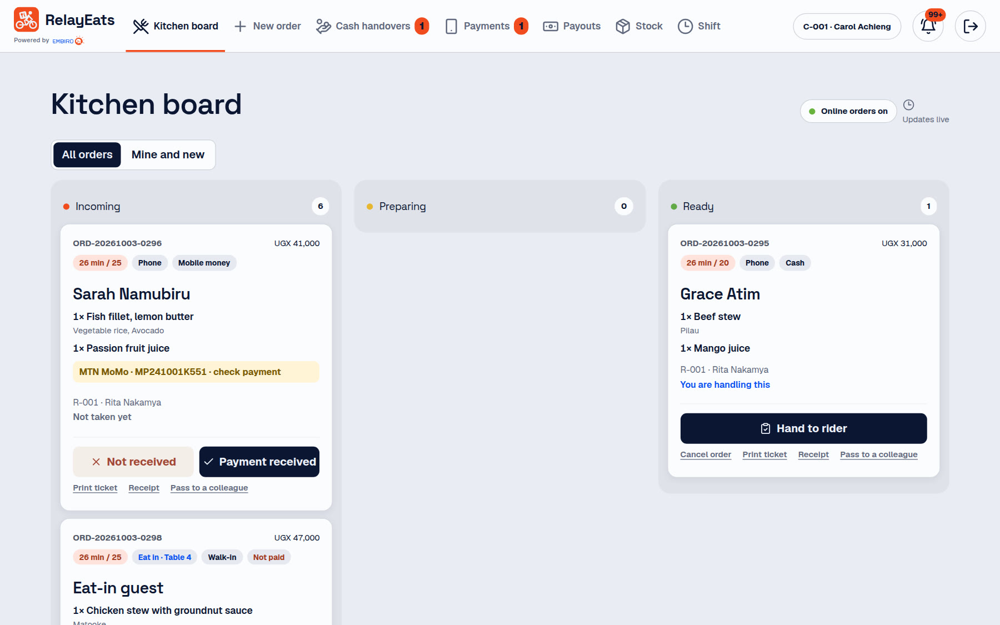

**The kitchen board.** Orders from riders and the counter arrive live, with a
sound, in **Incoming**, **Preparing** and **Ready**. Each ticket shows how long
it has waited against its prep time, how it was ordered and paid, and who is
handling it.

- **Accept** or **Reject** (with a reason) incoming orders; **Mark ready** when
  the food is done; **Hand to rider** when the rider collects it.
- **Mobile money and card payments** show their transaction ID on the ticket.
  Check it against the merchant statement or the card machine report, then
  tap **Payment received** or **Not received**.
- **Print ticket** prints a kitchen ticket; **Receipt** prints the customer's
  receipt (58 mm or 80 mm, with the EFRIS fiscal code when it is on).
- **Pass to a colleague** hands an order to another cashier on shift.

**Counter orders and split orders**

<table>
  <tr>
    <td width="50%">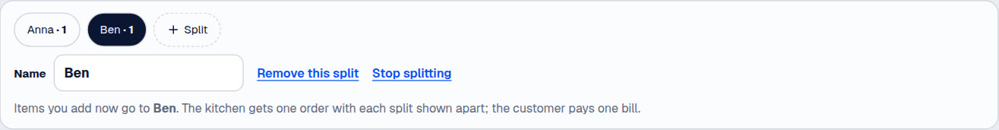  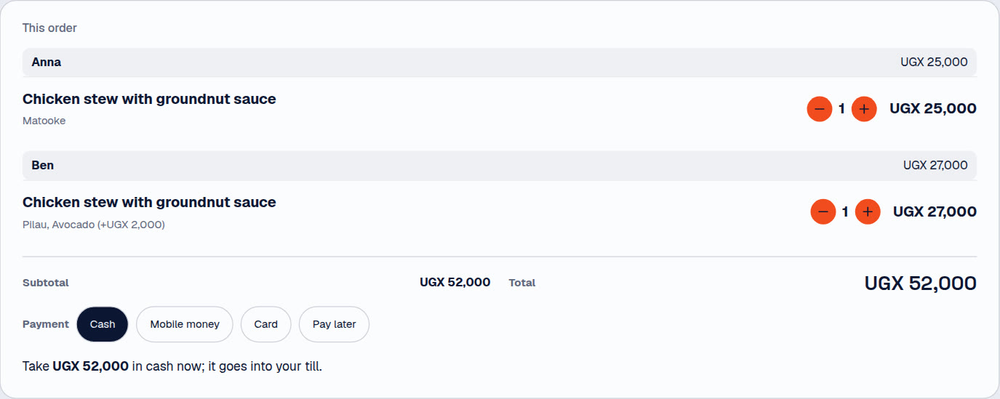</td>
    <td width="50%">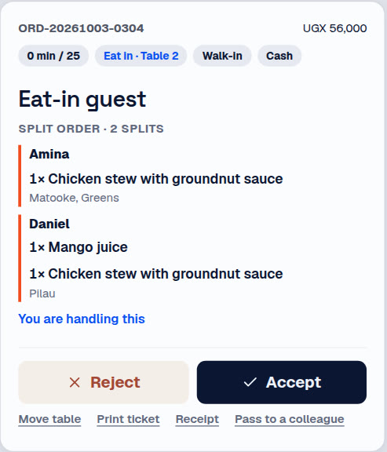</td>
  </tr>
</table>

1. **New order** → choose **Eat in**, **Pick up** or **Delivery** (a call-in
   order, with a rider chosen).
2. For a table, tap **Split order**. Name each split (for example the guest's
   name) and add their dishes. The same dish can be in two splits with
   different sides.
3. The summary shows each split with its own subtotal, then one total.
4. Take **Cash**, **Mobile money** or **Card** (with the transaction ID from
   the card machine slip), or **Pay later** to keep the bill open.
5. The kitchen gets one ticket marked **Split order**, with each person's
   dishes grouped. Tickets and receipts print the same way.

<table>
  <tr>
    <td width="50%">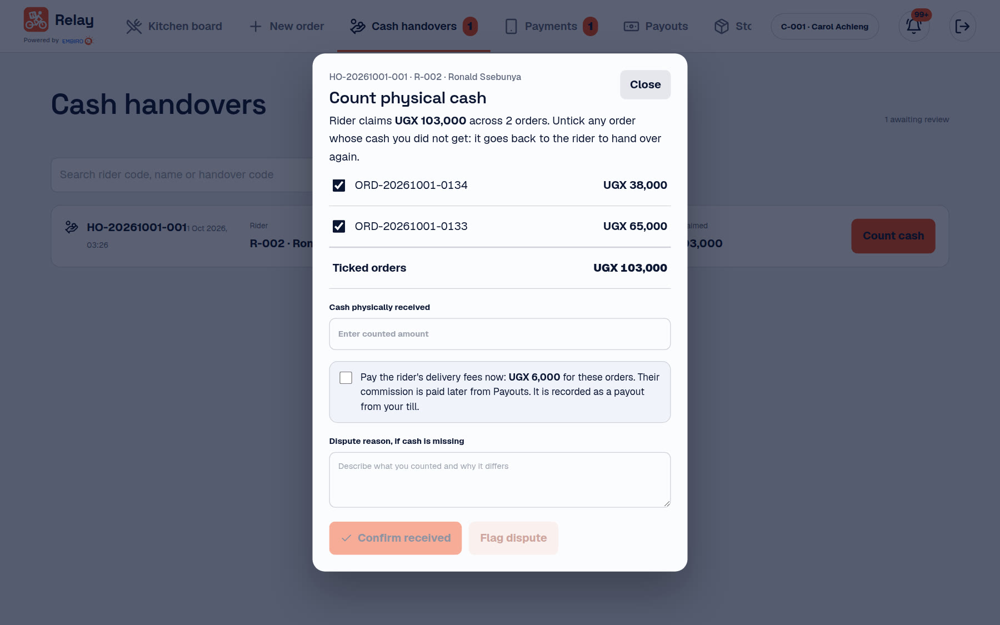</td>
    <td width="50%">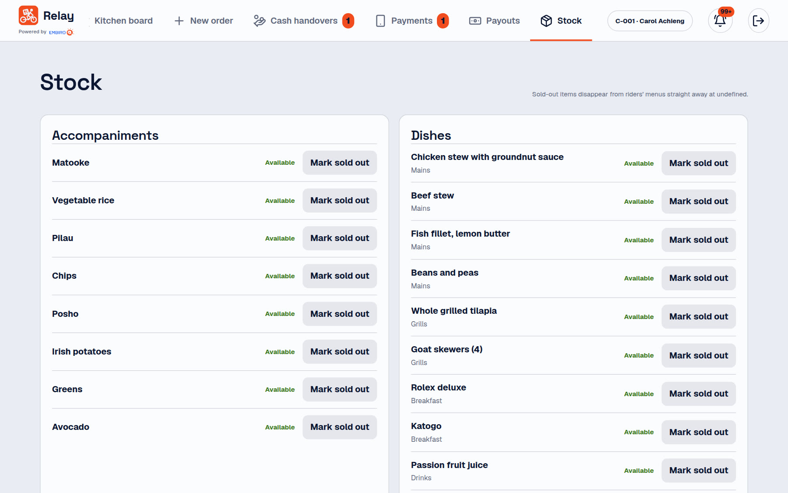</td>
  </tr>
  <tr>
    <td valign="top"><b>Cash handovers.</b> Open a rider's handover, count the cash and enter the amount. Untick an order whose cash you did not get; it goes back to the rider. Any shortfall is recorded with a reason. You can pay the rider's delivery fees from the till at the same time.</td>
    <td valign="top"><b>Stock.</b> Mark a dish or an accompaniment sold out for your branch. Riders and the counter stop seeing it at once.</td>
  </tr>
</table>

**Shifts and the till.** A cashier opens a shift by counting the till float,
pays out from the till with a reason (**Payouts**), and closes the shift by
counting the till again. RelayEats works out what should be there and records any
difference.

---

## Customers: order online

The restaurant's public menu at **/order** (on RelayEats Hosted, each
restaurant's own address, e.g. `aldea.relayeats.app/order`). Customers scan a
QR code on a flier or table card, or open a shared link, choose dishes and
sides, and order for **pick-up or delivery without signing in**. They pay
**cash on pick-up / delivery** or **mobile money** (a payment request to their
phone with automatic collection, or the merchant code and the transaction ID),
then follow the order live: received, being prepared, ready / on the way,
done. They can cancel until the kitchen starts. The phone remembers its
orders for two days: closing the page is fine, and reopening the menu shows
**Your orders** with the ones still on their way.

Deliveries can be priced **per km** (Admin → Online orders → Delivery charge
per km): the straight-line distance from the branch's map pin (Admin →
Branches) to the customer's location, which they share or pin on a map. Each
branch's pin is also where its team's maps open.

**Ordering from the table (eat in).** Switch on _Guests order from their
table_ in Admin → Online orders, add the tables (per branch) and print their
cards: each table has its own QR code. A guest scans the card, orders without
signing in or giving a name, and the order reaches the kitchen board as eat
in for that table (tagged **Table QR**). The bill stays open and is paid at
the end like any open bill (Take payment on the board). If the guests move,
**Move table** on the ticket moves the order and its bill. A lost or copied
card is retired with **New code**. **Served** works before the bill is paid:
the order stays on the board as _Served · waiting for payment_ and closes when
it is paid. Rescanning the table shows the orders still open at it.

**Refunds and vouchers.** Money paid for an order that is then cancelled is
the customer's voucher (Accounting → Refunds & vouchers). They spend it on a
new order, at the counter or online with their phone number: a voucher is used
whole, any rest of the bill is paid in cash or mobile money, and what the order
does not use stays theirs as a new voucher. Or the owner refunds it, less the
charges for sending it (flat and/or %), and the books show what was sent and
what was charged. Until then it is a liability on the balance sheet.

Orders arrive on the kitchen board as Incoming, tagged **Online**, with the
customer's number to call; deliveries are given a rider like call-in orders.
Cashiers can pause online orders when the kitchen is full. The owner switches
it on in **Admin → Online orders**, chooses pick-up / delivery and the ways to
pay, copies or shares the link, downloads the QR code, and prints **A4 / A5
fliers or table cards** with it.

## Owners

The owner works from any computer or phone, for all branches at once or one
at a time.

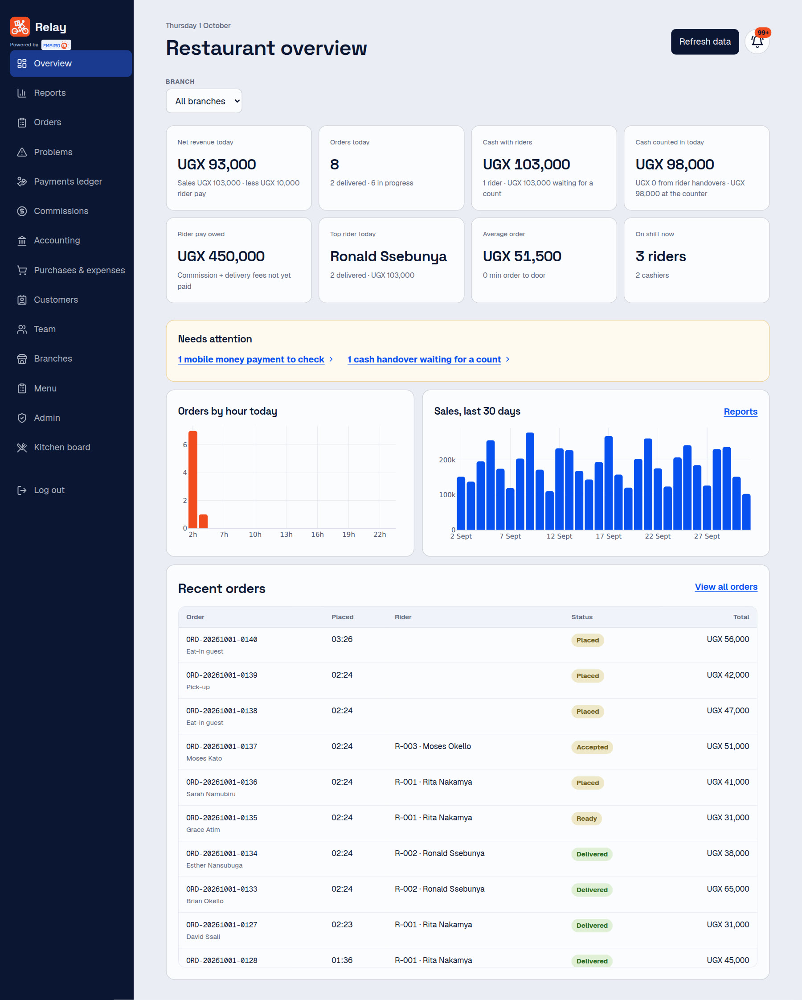

**Overview.** Net revenue today after rider pay, orders in progress, cash still
with riders, cash counted in, rider pay owed, the top rider and who is on
shift. **Needs attention** lists payments to check, problems riders reported
and handovers in dispute. Below are orders by hour, 30 days of sales and the
latest orders. The **Branch** picker switches everything to one branch.

<table>
  <tr>
    <td width="50%">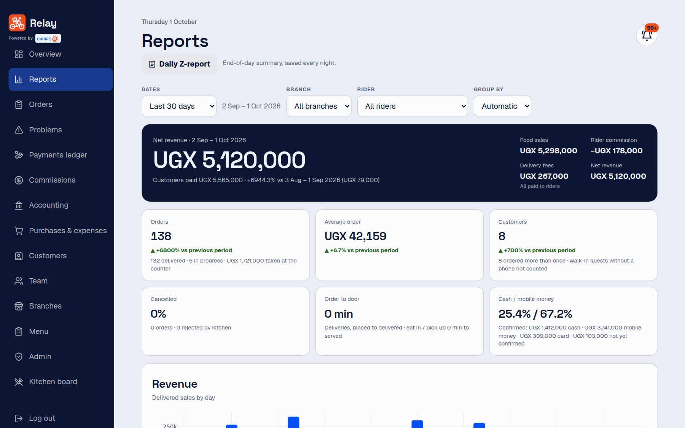</td>
    <td width="50%">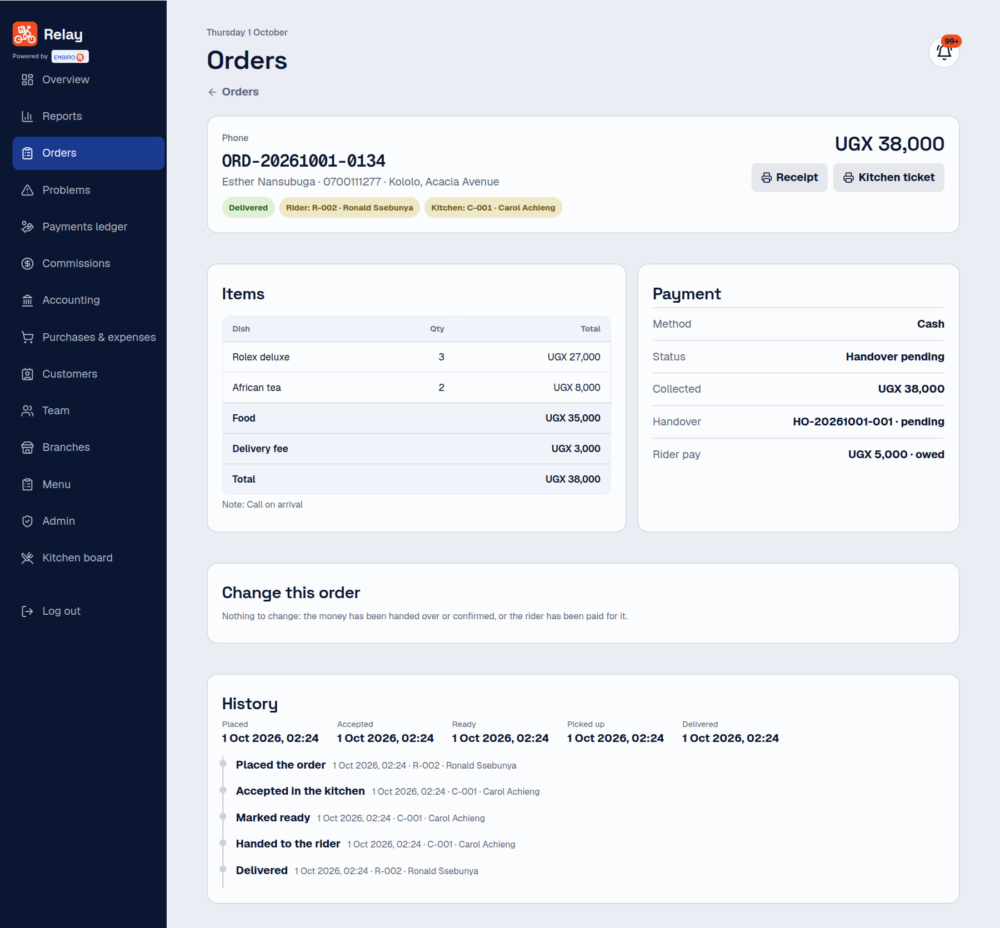</td>
  </tr>
  <tr>
    <td valign="top"><b>Reports.</b> Choose the dates, branch and rider. Revenue, orders, customers, cancellations, time to door, cash vs mobile money; sales by day, hour, dish, accompaniment, rider, channel and branch; month on month. <b>Daily Z-report</b> gives the end-of-day summary for any day, printable.</td>
    <td valign="top"><b>Orders.</b> Search by code, customer, rider, status or payment reference, and export to CSV. Each order shows its items, payment and full timeline. The owner can cancel, correct the payment, mark delivered, reopen or move it to another rider, always with a reason. Every change is in the audit log.</td>
  </tr>
  <tr>
    <td width="50%">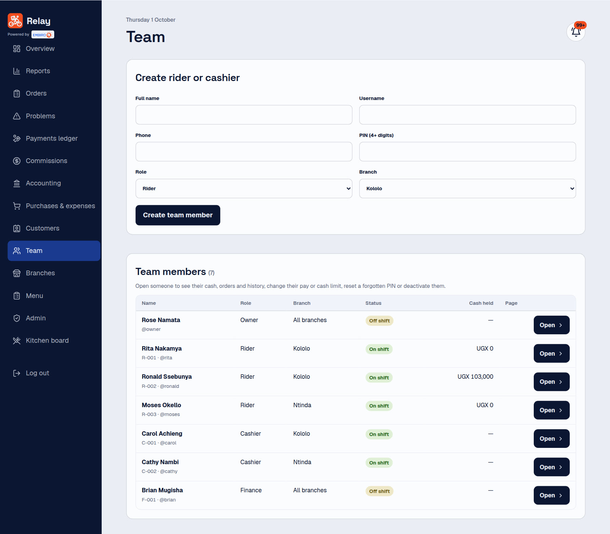</td>
    <td width="50%">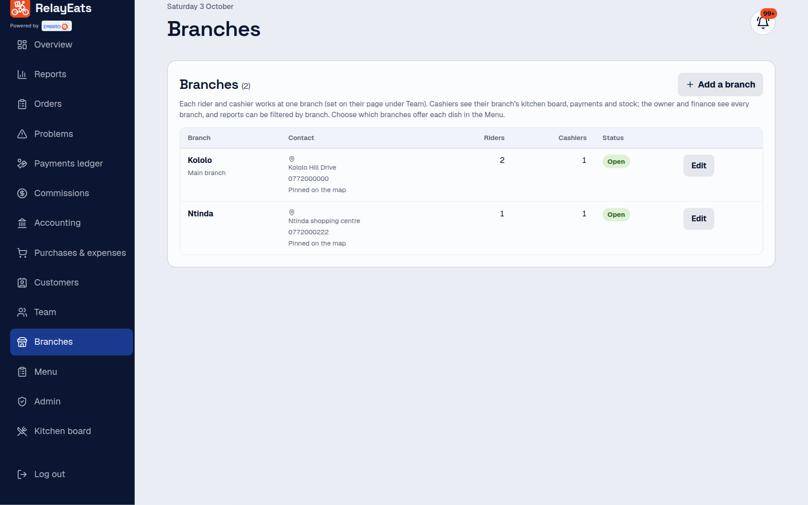</td>
  </tr>
  <tr>
    <td valign="top"><b>Team.</b> Create riders, cashiers and finance staff with a username and PIN, and give riders and cashiers a branch. Open someone to see their cash, orders and history, change their commission or cash limit, reset a forgotten PIN, change their branch or role, or deactivate them.</td>
    <td valign="top"><b>Branches.</b> Add branches with their address and phone, see how many riders and cashiers each has, and close a branch you no longer use. The first branch is made for you and keeps all existing orders.</td>
  </tr>
  <tr>
    <td width="50%">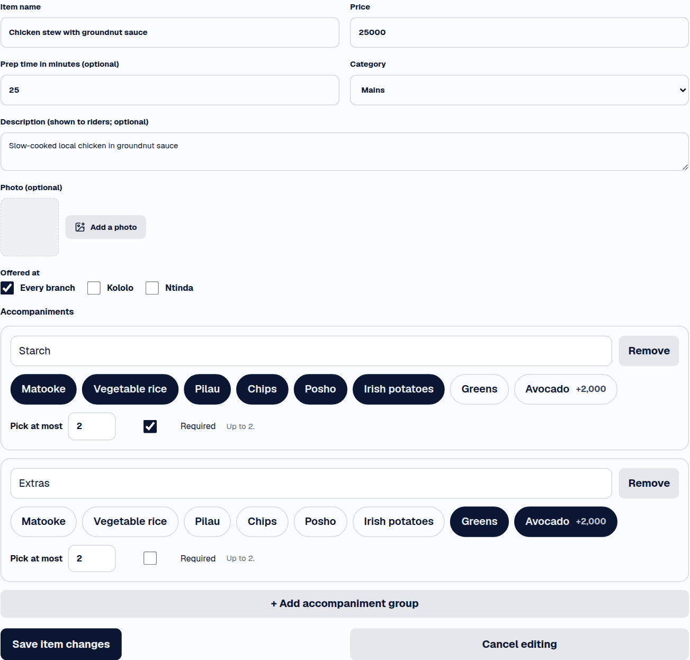</td>
    <td width="50%">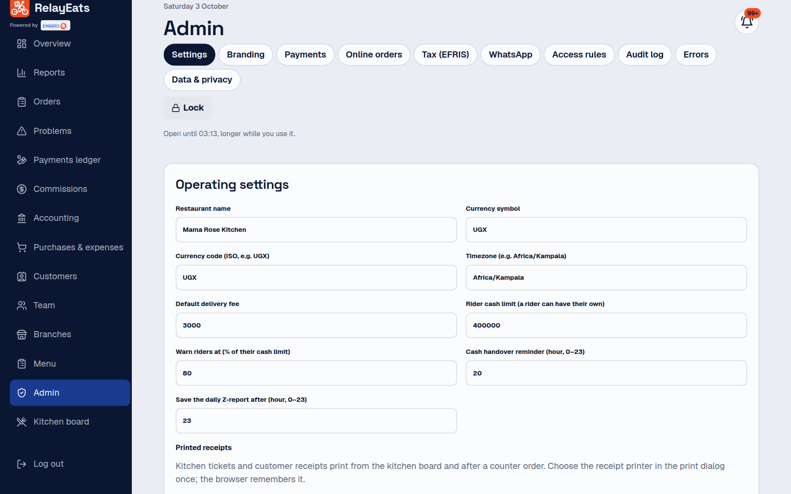</td>
  </tr>
  <tr>
    <td valign="top"><b>Menu.</b> Categories in the order the order screen shows them; accompaniments (free, or charged per portion); dishes with price, prep time, description, photo and accompaniment groups. <b>Offered at</b> chooses the branches that sell a dish. Import a whole menu from a spreadsheet (CSV).</td>
    <td valign="top"><b>Admin.</b> Opens with the owner's password again and locks after 15 minutes unused. Settings (name, currency, delivery fee, cash limits, counter and card), Branding, Payments (MTN MoMo and Airtel Money codes and automatic collection), Tax (URA EFRIS), WhatsApp, Access rules, Audit log, Errors and Data &amp; privacy (backups, restore, data retention).</td>
  </tr>
  <tr>
    <td width="50%">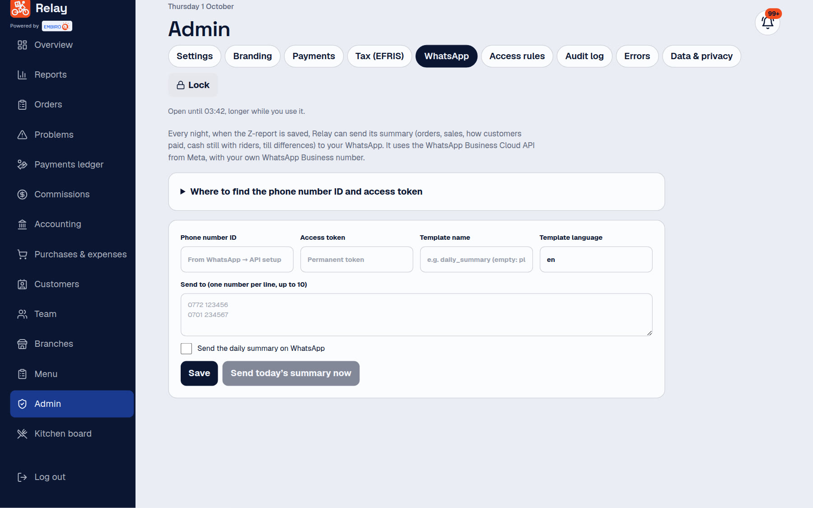</td>
    <td width="50%">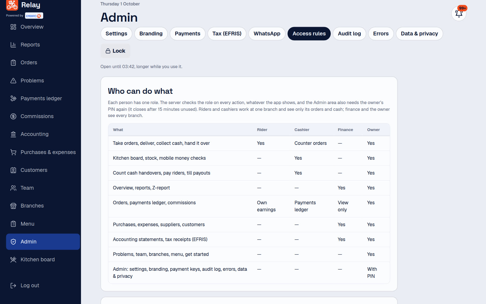</td>
  </tr>
  <tr>
    <td valign="top"><b>WhatsApp daily summary.</b> Every night the Z-report is sent to up to 10 numbers through the WhatsApp Business Cloud API. The page explains where to find the phone number ID, a permanent token and the template in Meta. On RelayEats Hosted the platform's number sends it and owners only enter the numbers.</td>
    <td valign="top"><b>Access rules.</b> Who can do what, by role. The server checks the role on every action, whatever the app shows.</td>
  </tr>
</table>

Also for the owner: **Problems** (issues riders reported, to resolve with a
note), **Payments ledger** (every payment with its state, by method),
**Commissions** (what each rider earned, paid and is owed),
**Customers** (search, history, spend, corrections) and the **Kitchen board**.

---

## Finance

The finance role sees the numbers and records spending. It has no kitchen
board and cannot change staff, the menu or the Admin settings.

<table>
  <tr>
    <td width="50%">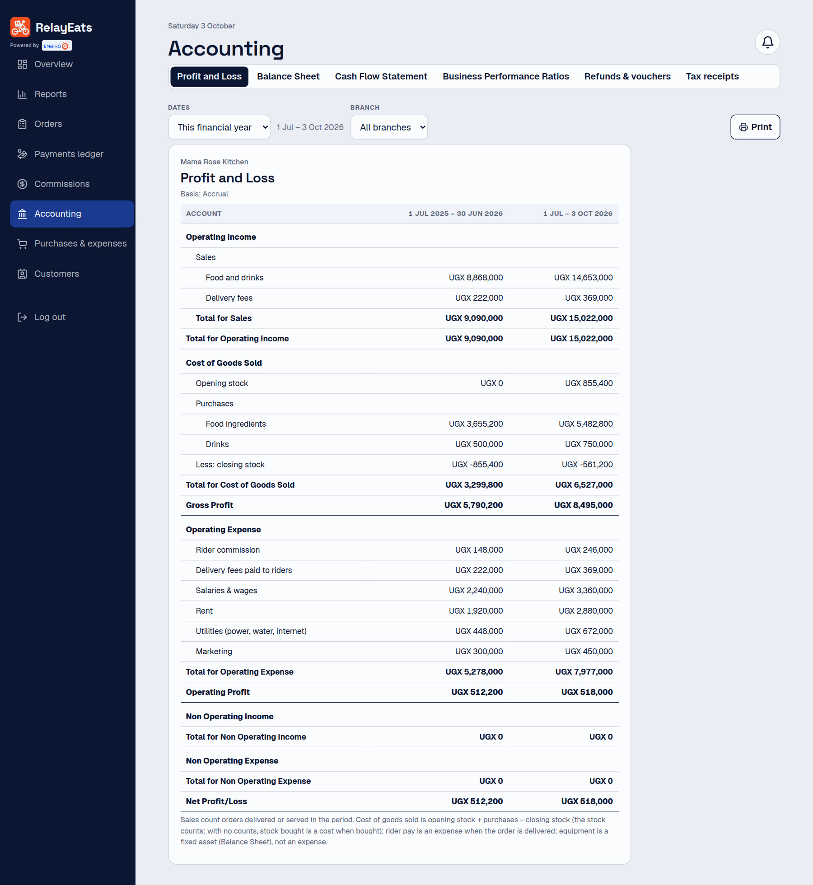</td>
    <td width="50%">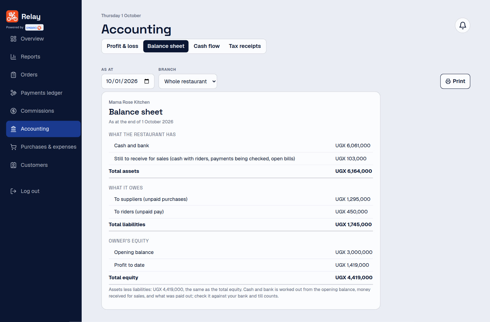</td>
  </tr>
  <tr>
    <td valign="top"><b>Profit &amp; loss.</b> Revenue from delivered and served orders; stock bought as cost of sales; rider commission, delivery fees, expenses and till payouts as operating costs. Compared with the previous period, by branch, printable.</td>
    <td valign="top"><b>Balance sheet.</b> As at any day: cash and bank (from the opening balance and every payment in and out), money still to receive, what is owed to suppliers and riders, and equity. It always balances.</td>
  </tr>
  <tr>
    <td width="50%">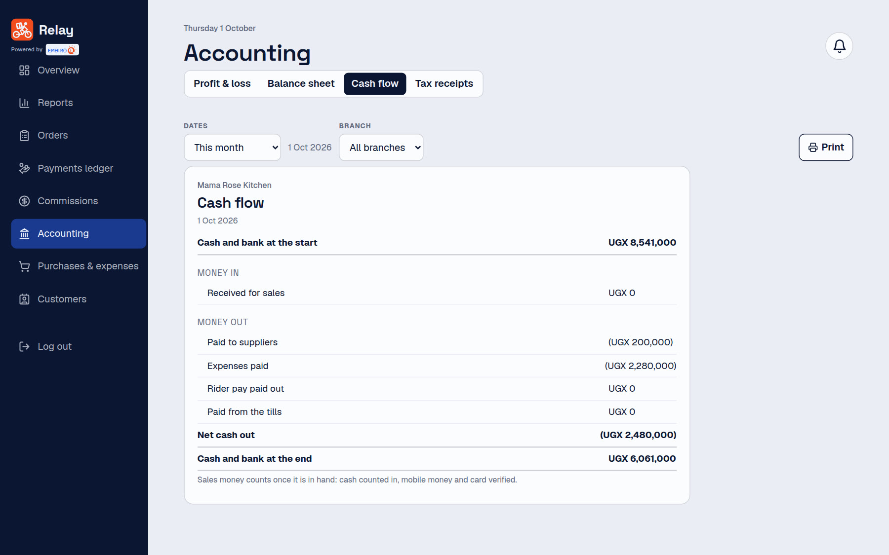</td>
    <td width="50%">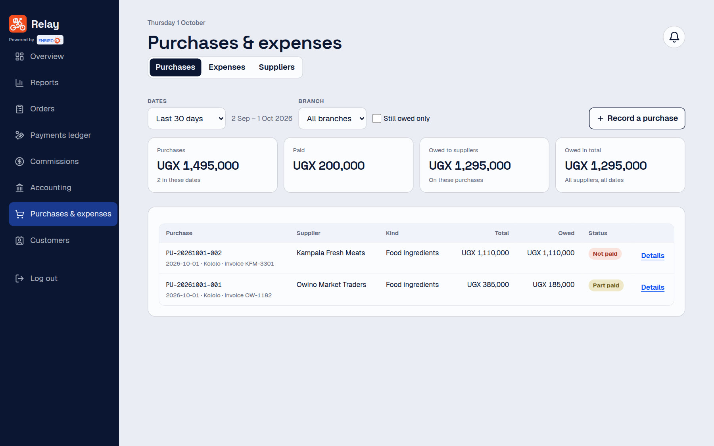</td>
  </tr>
  <tr>
    <td valign="top"><b>Cash flow.</b> Opening cash, money in, money out and closing cash, matching the balance sheet.</td>
    <td valign="top"><b>Purchases &amp; expenses.</b> Purchases from suppliers (lines, invoice number, paid now, in part or on credit; later payments recorded against them) and expenses by kind (rent, salaries, utilities…). Mistakes are voided with a reason, never deleted. <b>Suppliers</b> shows what is owed to each.</td>
  </tr>
</table>

**Tax receipts** (Accounting → Tax receipts) lists every sale's EFRIS status,
so finance can follow up anything not yet issued.

---

## RelayEats Hosted

The `hosted` branch runs many restaurants on one platform. Each restaurant's
data is kept apart, and everything above works the same way.

<table>
  <tr>
    <td width="50%">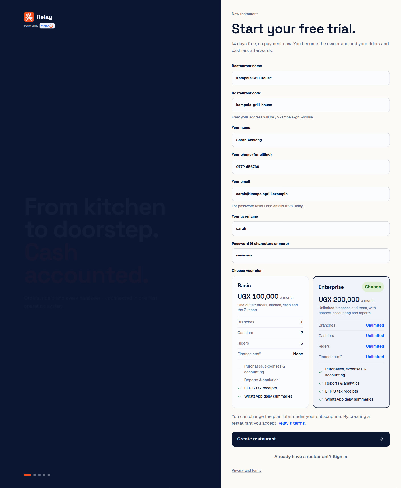</td>
    <td width="50%">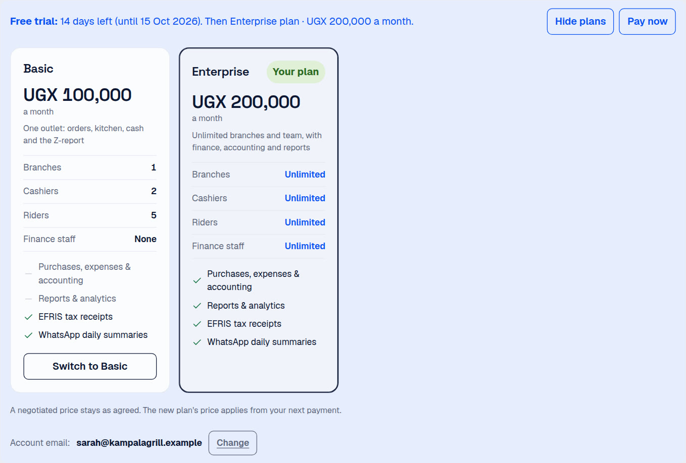  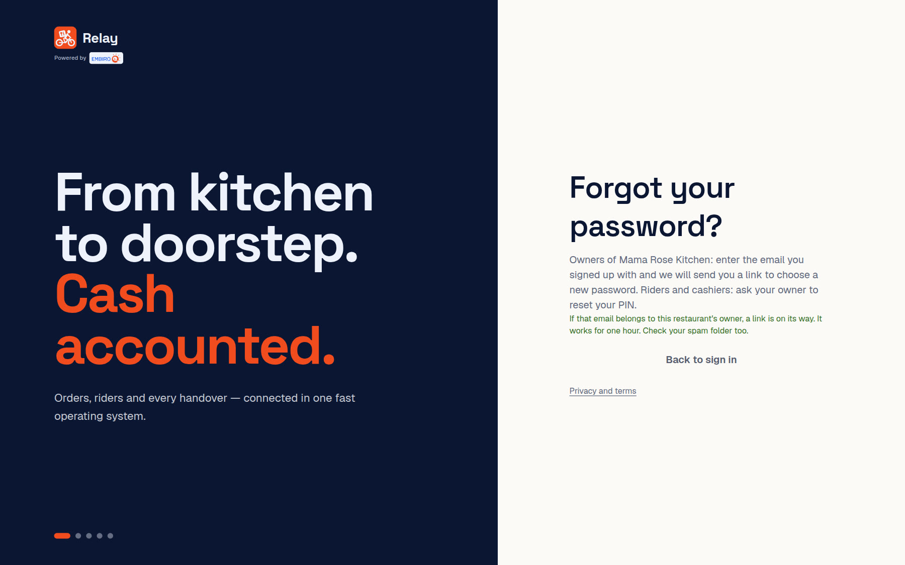</td>
  </tr>
  <tr>
    <td valign="top"><b>Sign up.</b> From the sign-in page, <b>Start a free trial</b>. The owner enters the restaurant's name (its code and address are suggested), their name, phone (for billing), email, username and password, and chooses a plan from the plan cards. The restaurant opens straight away with a free trial and a setup guide.</td>
    <td valign="top"><b>Subscription.</b> The Overview shows the trial or paid-until date and the monthly price. <b>Plans</b> compares the plans; the owner can switch (down only within the smaller plan's limits). <b>Pay now</b> pays by MTN MoMo or Airtel Money and gives a receipt. <b>Forgot password:</b> owners get a one-hour reset link at the email they signed up with; staff ask the owner for a new PIN.</td>
  </tr>
</table>

**Plans.** Basic (UGX 100,000 a month: 1 branch, 2 cashiers, 5 riders, no
finance role, no accounting or reports analytics) and Enterprise
(UGX 200,000: unlimited branches and team, everything included). Platform
staff can change them and create new ones.

**Platform console** (`/platform`, for RelayEats's own staff)

<table>
  <tr>
    <td width="50%">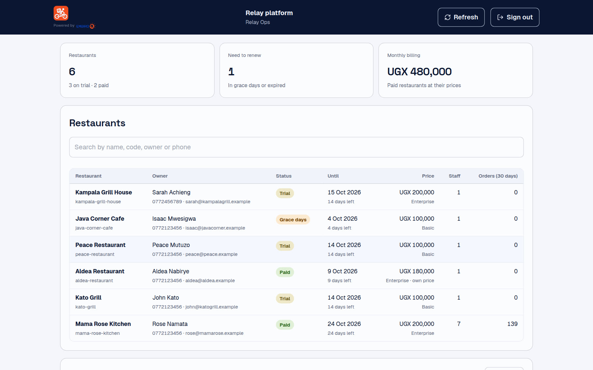</td>
    <td width="50%">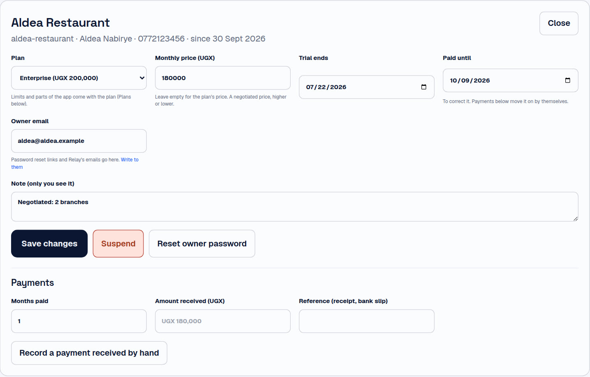</td>
  </tr>
  <tr>
    <td valign="top"><b>Restaurants.</b> Every restaurant with its owner, plan, status (trial, paid, grace days, suspended), dates, monthly price, staff and orders in the last 30 days, plus totals for the platform.</td>
    <td valign="top"><b>One restaurant.</b> Change its plan, agree a price, correct the trial or paid-until date, record a payment received by hand, change the owner's email, reset the owner's password, or suspend it. Every change is recorded.</td>
  </tr>
  <tr>
    <td width="50%">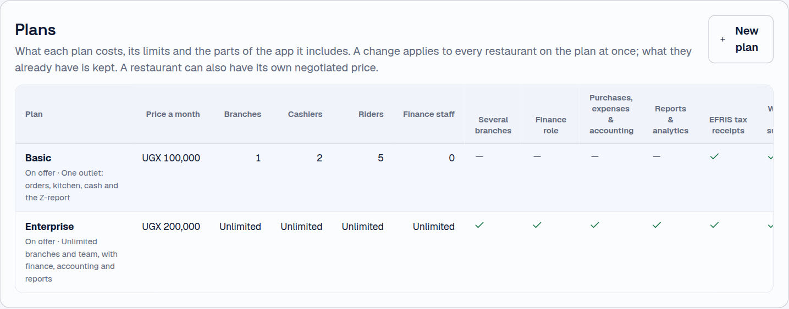  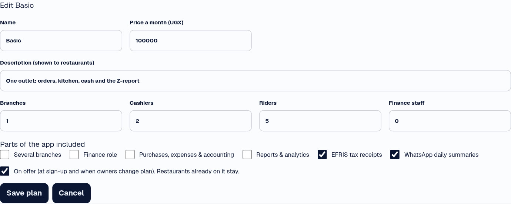</td>
    <td width="50%">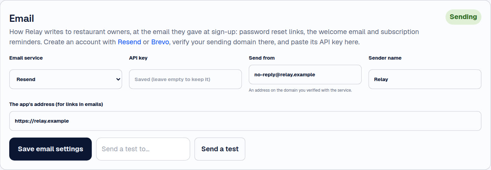  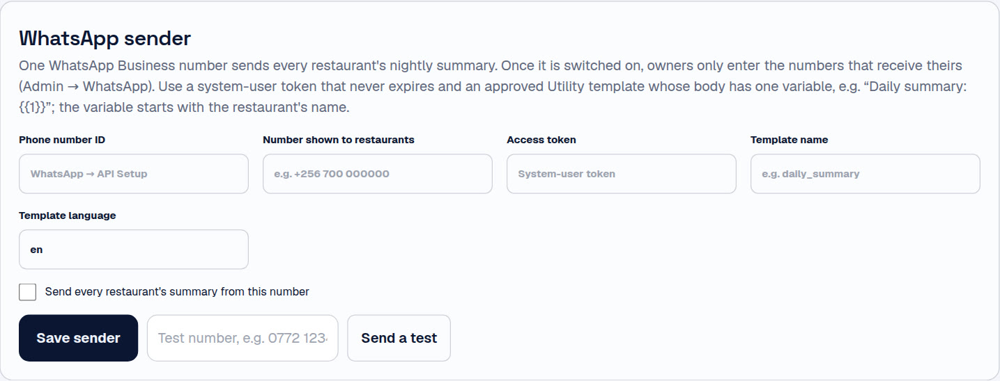</td>
  </tr>
  <tr>
    <td valign="top"><b>Plans.</b> Each plan's price, its limits on branches, cashiers, riders and finance staff (empty means unlimited), and the parts of the app it includes. A change applies to every restaurant on the plan; what they already have is kept.</td>
    <td valign="top"><b>Email and WhatsApp.</b> The email service (Resend or Brevo) for reset links, welcome emails and reminders, and the one WhatsApp number that sends every restaurant's nightly summary. Each has a test button.</td>
  </tr>
</table>

The console also has the platform settings (currency, trial and grace days,
support contact), security rules applied to every restaurant, errors from all
restaurants and recent changes. See [`docs/HOSTED.md`](docs/HOSTED.md).

---

## Who can do what

| Role           | Signs in with       | Main screens                                                                                                     |
| -------------- | ------------------- | ---------------------------------------------------------------------------------------------------------------- |
| Rider          | Username + PIN      | Home, New order, Active orders, Cash, Earnings                                                                   |
| Cashier        | Username + PIN      | Kitchen board, New order, Cash handovers, Payments, Payouts, Stock                                               |
| Finance        | Username + PIN      | Overview, Reports, Orders (view only), Payments ledger, Commissions, Accounting, Purchases & expenses, Customers |
| Owner          | Username + password | Everything above, plus Problems, Team, Branches, Menu, Admin (behind the password again) and the kitchen board   |
| Platform staff | Username + password | The platform console (RelayEats Hosted only)                                                                     |

## Development

You need Node 20.

    npm install
    npm run dev

- `npm run check` runs typecheck, lint, format, unit tests, the build and the
  Cloud Code bundle.
- After changing anything in `cloud/`, run `npm run build:cloud` and commit
  `back4app/cloud/main.js`. That single file is what gets uploaded to
  Back4App.
- `cd e2e && npm ci && PARSE_TEST_DATABASE_URI=... npm test` runs the Cloud
  Code end-to-end tests against a real Parse Server.

[`docs/ROADMAP.md`](docs/ROADMAP.md) has the product brief, conventions, the
Back4App release checklist, what is done and what is next.
[`README-EXPORT.md`](README-EXPORT.md) covers connecting a local copy to Parse.

Powered by Embiro — see [`NOTICE`](NOTICE).
